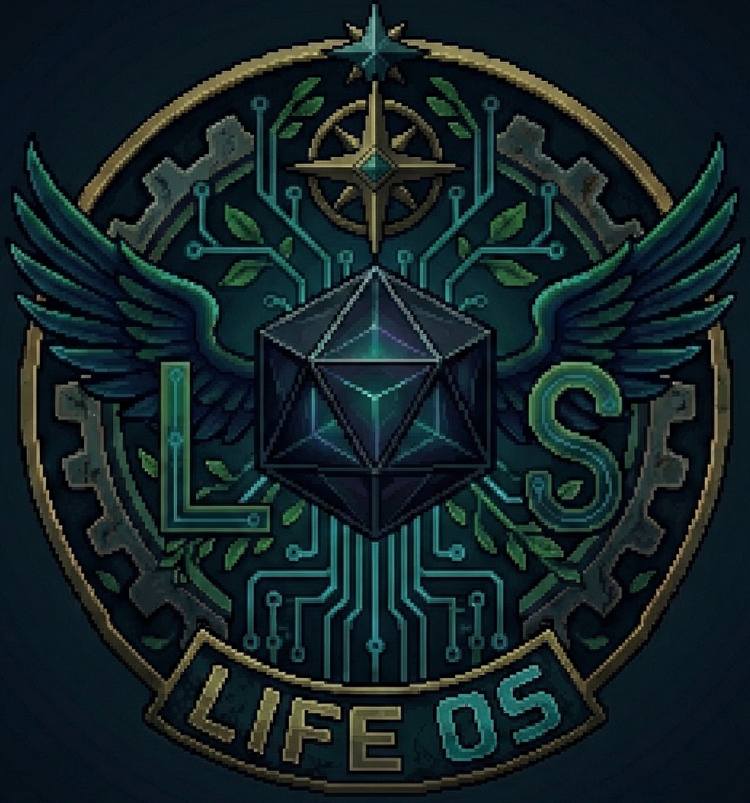

<p align="center">
  
</p>

<h1 align="center">⚔️ Shadow Slave — RPG Life OS</h1>

<p align="center">
  <strong>Transforme sua vida real em uma Campanha de RPG Dark Fantasy.</strong><br/>
  Um PWA de produtividade gamificada inspirado no universo de Shadow Slave.
</p>

<p align="center">
  <a href="https://shadow-slave-life-os.web.app" target="_blank">
    
  </a>
  &nbsp;
  
  &nbsp;
  
  &nbsp;
  
</p>

---

## 🌑 Sinopse

O **RPG Life OS** é um sistema operacional de vida pessoal gamificado, construído como PWA, onde cada tarefa concluída é um **Encontro vencido**, cada hábito mantido aumenta seus **Atributos**, e cada meta cumprida aproxima você de derrotar o **Boss da sua Campanha**.

Inspirado no sistema de progressão do universo *Shadow Slave* — com Ranks de *Adormecido* a *Profano* —, o app transforma sua rotina em uma jornada de RPG persistent persistente, com feedback visual de jogo real.

---

## ✨ Funcionalidades

| Módulo | Descrição |
|--------|-----------|
| ⚔️ **Quests** | Crie tarefas diárias e subtarefas com atributos (INT / ART / AVE). Ganhe XP e HP ao concluir. |
| 🏋️ **Treino** | Registre sessões de exercício com templates. Ganhe HP e XP por série completada. |
| 🏰 **Taverna (Finanças)** | Controle receitas, despesas e orçamento mensal com categorias e recorrência configurável. |
| 🗺️ **Modo Campanha (Boss Maps)** | Crie campanhas com mapa visual interativo, posicione o Boss, adicione Encontros e navegue pelos nós SVG. |
| 💎 **Memórias (Loot)** | Sistema de loot com itens únicos (Armas, Armaduras, Amuletos, Encantamentos) concedidos ao vencer Bosses e Quests. |
| 📊 **Atributos & Radar** | Evolua INT, ART e AVE baseado no tipo de atividade. Visualize no gráfico radar dinâmico. |
| 🎵 **BGM Engine** | Reprodutor de áudio nativo com playlist local, controles de play/pause/skip e volume. |
| 🏆 **Conquistas** | Sistema de achievements desbloqueados por milestones do jogo. |
| 🌗 **Temas Claro/Escuro** | UI completamente refinada para ambos os temas com design system de variáveis CSS. |

---

## 🎮 Sistema de Ranks (Nightmare Core)

Os Ranks de **Boss** seguem a hierarquia dos Pesadelos do universo Shadow Slave:

> 😴 Adormecido → 👁️ Desperto → 💀 Caído → 🖤 Corrompido → ⚡ Grande → 🩸 Amaldiçoado → 🌑 Profano

Os Ranks de **Jogador** evoluem conforme os Fragmentos de Sombra acumulados:

> Adormecido → Desperto → Ascendido → Santo → Soberano

---

## 🗺️ Assets (v1.0)

### Mapas de Fundo (16:9 · WebP)
| Asset | Bioma |
|-------|-------|
| Costa Esquecida | Costa / Ruínas |
| Bastião do Lago | Água / Fortaleza |
| Costa Azure | Praia de Cristais |
| Ermos Carmesins | Abismo Derretido |
| Espira Congelada | Gelo / Pico |
| Expansão s/ Estrelas | Berços Ocos |
| Metrópole Esquecida | Selva de Concreto |
| Planícies Verdejantes | Antiguidade |
| Profundezas Cintilantes | Clareira Sussurrante |
| Sepulcro Dourado | Deserto dos Ecos |
| Sepulcro Visceral | Deus Caído |

### Sprites de Boss (Pixel Art 16-bit · WebP)
Titã de Obsidiana, Boca do Pesadelo, Eco (Aethel), Sentinela (Jotun), Tirano (Pyroclast), Fauce Abissal, Geleia Voraz, Pássaro Ladrão, Rei das Vinhas, Semente da Escuridão, Soberano Esqueleto, Espadachim Desolado.

---

## 🛠️ Stack Técnica

```text
Front-end:  Vanilla JS (ES Modules) · HTML5 Semântico · CSS3 Vanilla (Design System)
Back-end:   Firebase Firestore (NoSQL Cloud DB) · Firebase Hosting (CDN)
PWA:        Service Worker (Cache v26) · Web App Manifest · Offline Support
Assets:     WebP otimizado · Pixel Art 16-bit · Sprites com fundo transparente
```

---

## 📂 Estrutura do Projeto

```text
rpg_life_os/
├── index.html                    # SPA Entry point
├── sw.js                         # Service Worker — cache v26
├── manifest.json                 # PWA Manifest
├── firebase.json                 # Firebase Hosting config
├── README.md
├── assets/
│   ├── maps/                     # 11 mapas 16:9 (.webp)
│   ├── bosses/                   # 12 sprites de boss (.webp)
│   ├── sprites_memorias/         # Sprites de loot (Memórias)
│   └── sfx/musics/               # BGM tracks locais (.mp3)
└── src/
    ├── config/
    │   └── assets_gallery.js     # ← Registre novos mapas/bosses aqui
    ├── engine/
    │   ├── core.js               # Estado global, XP, HP, Ranks
    │   ├── gamification.js       # Modais, Toasts, Loot drops
    │   ├── audio.js              # API do reprodutor de áudio
    │   └── music_player.js       # Engine de BGM (playlist local)
    ├── firebase/
    │   ├── auth.js               # Firebase Auth
    │   └── db.js                 # CRUD Firestore (quests, bosses, nodes…)
    ├── modules/
    │   ├── quests.js             # View de Quests
    │   ├── battle.js             # View de Treino
    │   ├── taverna.js            # View de Finanças
    │   ├── campaign_map.js       # View de Campanha (boss maps, nodes, SVG)
    │   ├── inventory.js          # View de Memórias (loot grid)
    │   └── bosses.js             # Legado de compatibilidade
    └── ui/
        ├── app.js                # Orquestrador de UI e navegação
        ├── style.css             # Core Design System + variáveis
        ├── style-campaign.css    # Modo Campanha + mini-mapa
        ├── style-phase3.css      # Light/Dark Theme overrides
        └── style-player.css      # BGM Player UI
```

---

## 🚀 Como Adicionar Novos Assets

### Novos Mapas
1. Coloque o arquivo `.webp` em `/assets/maps/`
2. Registre-o em `src/config/assets_gallery.js`:
   ```js
   { id: 'meu_mapa', path: '/assets/maps/meu_mapa.webp', name: 'Meu Mapa' },
   ```
3. Atualize a versão de cache em `sw.js` e rode `firebase deploy --only hosting`.

### Novos Bosses
Mesmo processo com `/assets/bosses/` e `BOSS_GALLERY` no mesmo arquivo.

---

## 🚀 Como Rodar Localmente

```bash
# 1. Clone o repositório
git clone https://github.com/SEU_USUARIO/rpg-life-os.git

# 2. Sirva localmente (necessário para Service Worker)
python -m http.server 8765

# 3. Acesse http://localhost:8765
```

> **Importante:** Configure suas próprias credenciais Firebase em `src/firebase/db.js` e `src/firebase/auth.js` se quiser usar seu próprio banco de dados.

---

## ☁️ Deploy (Firebase Hosting)

```bash
# 1. Incremente a versão de cache em sw.js (ex: v26 → v27)
# 2. Deploy
firebase deploy --only hosting
```

🔗 Live: **https://shadow-slave-life-os.web.app**

---

## 🛤️ Roadmap

- [ ] Integração com Spotify (streaming de playlists)
- [ ] Animações de idle para sprites de Boss
- [ ] Notificações push para Quests pendentes
- [ ] Multiplayer cooperativo (compartilhar campanhas)
- [ ] Exportar/importar backup de dados

---

## 📄 Licença

Este projeto está licenciado sob [MIT License](LICENSE).
